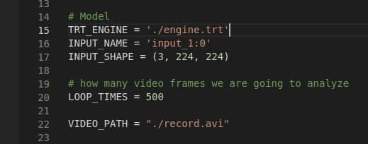
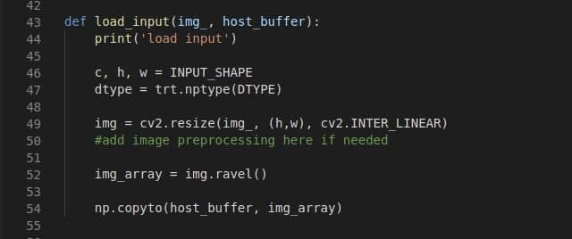

# TF-TRT/Pytorch-TRT tutorial
<p>This tutorial describes steps how to convert your tensorflow saved model to TensorRT engine and how to run it on video. You can also folow the same steps if you have Pytorch model, the difference is only in the first step (converting to ONNX)</p>

## There steps are:
* Convert saved model to ONNX
* Simplify ONNX model using onnxsimplifier python library
* Copy siplified ONNX model from your PC to Jetson
* Create TensorRT engine from ONNX model on the Jetson using trtexec
* Adjust given script for inferencing(change the model shape, output names, adjust input preprocesing and output processing), and run the script

### Convert saved model to ONNX using tf2onnx python library (skip if you have Pytorch model):
<p> Install tf2onnx:  </p>

```console
pavlo@pc:~$ pip3 install tf2onnx
```

<p> Convert tf saved model to onnx: </p> 

```
pavlo@pc:~$ python3 -m tf2onnx.convert --saved-model "my_tf_saved_model" --output "my_model.onnx" --opset 11
```

### If you have Pytorch model, convert it to onnx using folowing example:
```
import torch
import torch.onnx

# A model class instance (class not shown)
model = MyModelClass()

# Load the weights from a file (.pth usually)
state_dict = torch.load(weights_path)

# Load the weights now into a model net architecture defined by our class
model.load_state_dict(state_dict)

# Create the right input shape (e.g. for an image)
dummy_input = torch.randn(sample_batch_size, channel, height, width)

torch.onnx.export(model, dummy_input, "my_model.onnx")
```

### Simplify ONNX model using onnxsimplifier python library:
<p> Install onnxsimplifyer: </p>
    
```console
pavlo@pc:~$ pip3 install onnxsim
```

<p> Simplify onnx model: </p> 

```
pavlo@pc:~$ python3 -m onnxsim my_model.onnx my_model_simpl.onnx --input-shape 1,224,224,3
```

<p><b>Now copy my_model_simpl.onnx to Jetson device </p></b>

### Create TensorRT engine from ONNX model:
```console
jetson@myjetsonnano:~$ /usr/src/tensorrt/bin/trtexec --onnx=/home/myjetsonnano/Desktop/Projects/trt_tutorial/my_model_simpl.onnx --shapes=\'input_1:0\':1x224x224x3 --saveEngine=/home/myjetsonnano/Desktop/Projects/trt_tutorial/engine.trt --verbose --explicitBatch
```

### Install dependencies on Jetson to run the script for inferencing:

```console
export PATH=/usr/local/cuda-10.2/bin:$PATH
export LD_LIBRARY_PATH=/usr/local/cuda-10.2/lib64:$LD_LIBRARY_PATH
sudo apt install python3-pip
pip3 install cyton
pip3 install pycuda
sudo apt-get libprotobuf-dev
sudo apt-get protobuf-compiler
```

<p> Open run_trt_engine_on_video.py and edit input name, input shape and path to the video:</p>



<p> add data preprocessing if needed:</p>



<p> <b>Now run the script! </b></p>
<p>P.S if your model has 2 outputs, you should uncoment commented lines</p>


